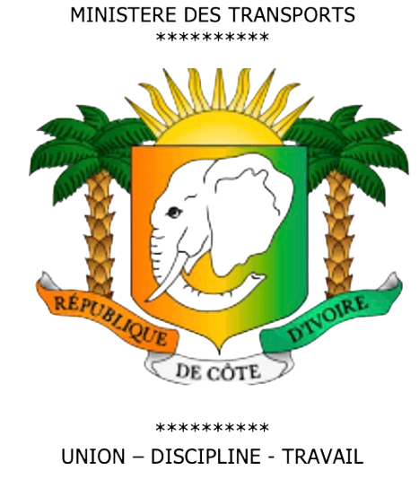
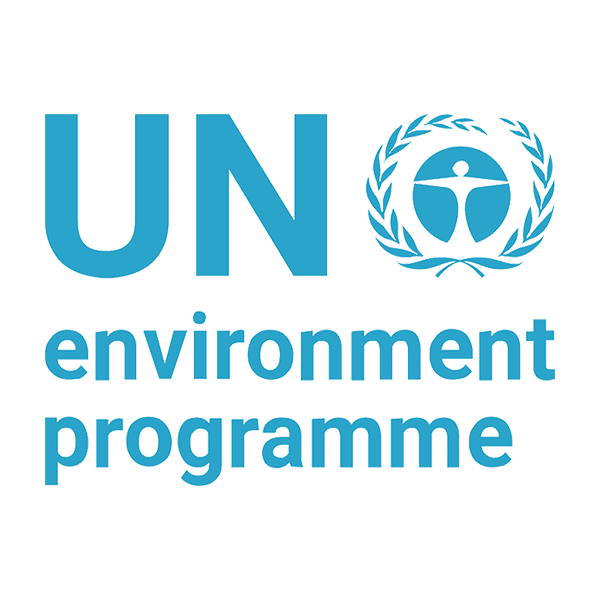

<!-- Section avec logos institutionnels et fond bleu ciel -->

    

        
        
        
        
    

    
    

        Dictionnaire de terminologie météorologique en 7 langues de Côte d'Ivoire
    

## 🌍 À propos du projet

Bienvenue dans le **Lexique Météorologique Multilingue** de la Côte d'Ivoire ! Ce projet innovant a été développé par la **SODEXAM** (Société d'Exploitation et de Développement Aéroportuaire, Aéronautique et Météorologique) en collaboration avec le **PNUE** (Programme des Nations Unies pour l'Environnement).

### 🎯 Objectifs

Ce lexique, financé par le **PNUE** (Programme des Nations Unies pour l'Environnement) et l'**Union Européenne**, vise à :

- **Démocratiser** l'accès aux informations météorologiques dans les langues locales
- **Faciliter** la communication météorologique avec les communautés rurales
- **Préserver** et valoriser la richesse linguistique de la Côte d'Ivoire
- **Améliorer** la diffusion des alertes météorologiques et climatiques
- **Soutenir** l'adaptation au changement climatique

## 📚 Contenu du lexique

Ce document est un lexique complet de terminologie météorologique en français facile et dans 7 langues locales de Côte d'Ivoire (Baoulé, Bété, Lobi, Malinké, Sénoufo, Koulango et Yacouba). Il vise à faciliter la compréhension des bulletins météorologiques par les populations locales.

### 🗣️ Langues disponibles

    

        
🇫🇷 Français

        
Langue officielle et définitions en français facile

    

    

        
🌍 Baoulé

        
Langue Akan parlée au centre de la Côte d'Ivoire

    

    

        
🌍 Bété

        
Langue Kru de l'ouest ivoirien

    

    

        
🌍 Lobi

        
Langue Gur du nord-est

    

    

        
🌍 Malinké

        
Langue Mandé du nord-ouest

    

    

        
🌍 Sénoufo

        
Langue Gur du nord

    

    

        
🌍 Koulango

        
Langue Gur de l'est

    

    

        
🌍 Yacouba

        
Langue Mandé de l'ouest

    

## 📖 Comment utiliser ce lexique

### 🔍 Navigation

1. **Parcourir par catégories** : Utilisez le menu de navigation pour explorer les termes par ordre alphabétique
2. **Rechercher** : Utilisez la barre de recherche en haut de la page pour trouver rapidement un terme
3. **Navigation séquentielle** : Utilisez les liens "Précédent" et "Suivant" en bas de chaque page

### 🔊 Fonctionnalités audio

Chaque terme dispose de boutons audio (🔊) pour écouter la prononciation dans chaque langue :

- Cliquez sur le bouton 🔊 à côté de chaque traduction
- L'audio se lance automatiquement
- Un seul audio peut jouer à la fois
- Utilisez la touche **Escape** pour arrêter la lecture

### 📱 Compatibilité

Ce lexique est optimisé pour :

- **Ordinateurs** (Windows, macOS, Linux)
- **Tablettes** et **smartphones** (iOS, Android)
- **Navigateurs modernes** (Chrome, Firefox, Safari, Edge)
- **Connexions lentes** (optimisation des fichiers)

## 🌟 Exemples de termes

Découvrez quelques exemples de termes disponibles dans le lexique :

### [🏠 Abri météo](abri-meteo.md)
*Petite cage blanche contenant des instruments météo*

### [☁️ Accalmie](accalmie.md)
*Période de calme entre deux tempêtes*

### [🌡️ Adaptation](adaptation.md)
*Ajustement aux changements climatiques*

### [💨 Aérosol](aerosol.md)
*Petites particules dans l'air*

### [⛰️ Altitude](altitude.md)
*Hauteur par rapport au niveau de la mer*

!!! tip "Conseil d'utilisation"
    Pour une meilleure expérience, activez le son de votre appareil et utilisez des écouteurs si vous êtes dans un environnement bruyant.

## 🎓 Méthodologie de développement

### 👥 Équipe de travail

Ce lexique a été élaboré grâce à la collaboration de :

- **Météorologues experts** de la SODEXAM
- **Linguistes spécialisés** dans les langues ivoiriennes
- **Locuteurs natifs** de chaque langue locale
- **Experts en communication** climatique

### 🔬 Processus d'élaboration

1. **Identification** des termes météorologiques essentiels
2. **Consultation** avec les experts linguistiques
3. **Traduction** collaborative avec les communautés locales
4. **Validation** par les locuteurs natifs
5. **Harmonisation** et standardisation
6. **Test** et amélioration continue

### ✅ Contrôle qualité

- Validation par des comités linguistiques locaux
- Révision par des météorologues professionnels
- Tests d'utilisabilité avec les communautés cibles
- Mise à jour régulière basée sur les retours

## 🤝 Partenaires et soutiens

    

        
        
🏢 SODEXAM

        
Société d'Exploitation et de Développement Aéroportuaire, Aéronautique et Météorologique de Côte d'Ivoire

        
    

    

        
        
🌍 PNUE

        
Programme des Nations Unies pour l'Environnement

    

    

        
        
🇪🇺 Union Européenne

        
Soutien financier et technique

    

    

        
        
👥 Communautés locales

        
Contribution linguistique et validation culturelle

    

## 📊 Statistiques du projet

| Indicateur | Valeur |
|------------|--------|
| **Termes traduits** | 200+ |
| **Langues couvertes** | 7 |
| **Fichiers audio** | 1600+ |
| **Locuteurs des langues** | 15+ millions de personnes |
| **Régions couvertes** | Nord, Est, Ouest, Centre |

## 🚀 Développements futurs

### Phase 2 (horizon 2030)

- Extension à d'autres langues ivoiriennes (Dioula, Agni, Abbey, etc )
- Développement d'une application mobile
- Intégration avec les systèmes d'alerte SMS
- Formation des agents météorologiques régionaux
- Intégration avec les radios communautaires

## 📞 Contact et feedback

Nous valorisons vos retours pour améliorer continuellement ce lexique !

### 📧 Contacts

- **SODEXAM** : contact@sodexam.ci
- **Équipe technique** : decam@sodexam.ci (Département de la Climatologie et des Applications Météorologiques)
- **Support** : support@lexique-meteo.ci

### 💬 Comment contribuer

- Signaler des erreurs ou imprécisions
- Proposer de nouveaux termes
- Suggérer des améliorations
- Partager vos retours d'utilisation

## 📄 Licence et propriété intellectuelle

<strong>© SODEXAM - Tous droits réservés</strong>  
Ce projet est la <strong>propriété exclusive de la SODEXAM</strong> (Société d'Exploitation et de Développement Aéroportuaire, Aéronautique et Météorologique).

### ✅ Vous pouvez

- Consulter et utiliser gratuitement
- Intégrer dans vos projets éducatifs à but non commercial

### 🚫 Restrictions d'utilisation

- **Pas de duplication** - Reproduction interdite sans autorisation
- **Usage non commercial uniquement** - Toute utilisation commerciale est strictement interdite
- **Attribution obligatoire** - Toute utilisation autorisée doit créditer la SODEXAM
- **Tous droits réservés** - Toute utilisation nécessite l'autorisation écrite de la SODEXAM

### 🤝 Contributions

Pour toute contribution ou amélioration, veuillez contacter : **contact@sodexam.ci**

---

    

        🌍 Développé avec ❤️ par la SODEXAM - Côte d'Ivoire
    

    

        En partenariat avec le PNUE et l'Union Européenne
    

