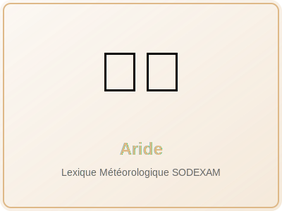

# Aride

    <h1 class="terme-title">Aride</h1>
    

    Aride
    <button class="audio-btn" data-audio="../audio/aride_fr.mp3" title="Écouter la prononciation">🔊</button>

{ .terme-image }

## Définition (Français facile)

Terme météorologique en français

## Traductions

    

        

            
Baoulé

            

    Kee
    <button class="audio-btn" data-audio="../audio/aride_baoule.mp3" title="Écouter la prononciation">🔊</button>

        

        

            
Bété

            

    Sιɛka
    <button class="audio-btn" data-audio="../audio/aride_bete.mp3" title="Écouter la prononciation">🔊</button>

        

        

            
Lobi

            

    kʰɩ̀ɩ̀
    <button class="audio-btn" data-audio="../audio/aride_lobi.mp3" title="Écouter la prononciation">🔊</button>

        

        

            
Malinké

            

    ɟalan
    <button class="audio-btn" data-audio="../audio/aride_malinke.mp3" title="Écouter la prononciation">🔊</button>

        

        

            
Sénoufo

            

    nwáà
    <button class="audio-btn" data-audio="../audio/aride_senoufo.mp3" title="Écouter la prononciation">🔊</button>

        

        

            
Koulango

            

    hɩ́lɛ̰̀
    <button class="audio-btn" data-audio="../audio/aride_koulango.mp3" title="Écouter la prononciation">🔊</button>

        

        

            
Yacouba

            

    gbla̰̋a̰̋gblàà
    <button class="audio-btn" data-audio="../audio/aride_yacouba.mp3" title="Écouter la prononciation">🔊</button>

        

    

---

[🏠 Retour à l'accueil](../index.md) | [◄ Arc-en-ciel](arc-en-ciel.md) | [Atmosphère ►](atmosphere.md)

!!! info "À propos de ce terme"
    Ce terme fait partie du lexique météorologique multilingue développé par la SODEXAM (Société d'Exploitation et de Développement Aéroportuaire, Aéronautique et Météorologique) de Côte d'Ivoire. Les traductions ont été élaborées en collaboration avec des locuteurs natifs des différentes langues locales.

Français

Baoulé

Bété

Koulango

Lobi

Malinké

Sénoufo

Yacouba

